# 🤖 AgendaBot | Asistente Inteligente de Gestión de Citas vía Telegram

📝 Descripción General
Este proyecto es una solución de software automatizada diseñada para gestionar el ciclo de vida completo de una cita o reserva a través de una interfaz conversacional (Telegram). El sistema elimina la necesidad de intervención humana para agendar, reprogramar o cancelar citas, actuando como un secretario virtual disponible 24/7.

El núcleo del sistema está construido sobre n8n (motor de flujos de trabajo), utilizando Google Sheets como base de datos relacional en tiempo real y Telegram como interfaz de usuario (Front-end).

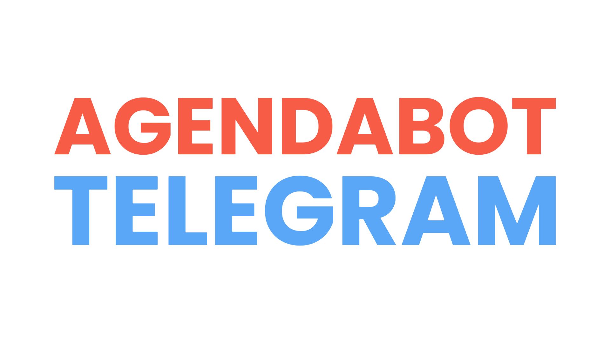

## 🛠️ Módulos y Funcionalidades Principales
El sistema se divide en 4 pilares fundamentales, accesibles a través de un menú interactivo:

### 1. 📅 Agendamiento Inteligente (Smart Booking)
Permite al usuario reservar un espacio en la agenda mediante un flujo guiado. No es un simple formulario; cuenta con Lógica de Negocio avanzada:

- Validación de Formato (Regex): El bot detecta automáticamente si el usuario ingresa fechas o horas en formatos incorrectos y solicita corrección inmediata.

- Bloqueo de "Viaje en el Tiempo": Implementa validaciones con librerías de tiempo (Luxon) para impedir que se agenden citas en fechas pasadas.

- Prevención de Colisiones: Antes de confirmar, el sistema consulta la base de datos para verificar que el horario elegido no esté ocupado por otro usuario, evitando la doble reserva (Double-booking).

- Persistencia de Sesión: El bot "recuerda" los datos temporales (fecha, hora) durante la conversación sin guardarlos en la base de datos hasta que la validación es exitosa.

### 2. ❌ Gestión y Cancelación (Self-Service)
Empodera al usuario para gestionar sus propios compromisos sin contactar a soporte.

Consulta en Tiempo Real: El usuario puede ver una lista de sus citas pendientes. El sistema filtra la base de datos usando el ID único de Telegram para asegurar privacidad (cada usuario ve solo sus citas).

Reprogramación Flexible: Permite modificar fecha y hora de una cita existente, aplicando las mismas reglas de validación y anti-colisión del módulo de agendamiento.

Cancelación Lógica: Al cancelar, la cita no se borra (para mantener el historial), sino que cambia su estado a "Cancelada", liberando el cupo para otros usuarios.

### 3. 🔔 Sistema de Notificaciones Híbrido
Este módulo se compone de dos partes que trabajan en paralelo:

Panel de Preferencias (Frontend): El usuario tiene el control total. Puede decidir con cuánta antelación quiere ser avisado (30 min, 1 hora, 1 día) o desactivar las notificaciones por completo ("Modo No Molestar").

Motor Automático (Backend - Cron Job): Un proceso independiente se ejecuta cada 10 minutos en el servidor. Este "robot silencioso":

Escanea todas las citas pendientes.

Cruza la información con las preferencias de cada usuario.

Calcula matemáticamente si es el momento exacto de avisar.

Envía el recordatorio y marca la cita como "Avisada" para evitar spam.

### 4. 📊 Reportes y Analítica Personal
Transforma los datos crudos en información de valor para el usuario.

Resumen Ejecutivo: Genera un reporte instantáneo con KPIs: Total de citas, Asistidas, Pendientes y Canceladas.

Próxima Acción: Identifica y muestra cuál es la cita inminente más cercana.

Historial: Muestra un log cronológico de las últimas interacciones, permitiendo al usuario llevar un control de su actividad.

## 💠 Funcionamiento por estados

El bot funciona mediante un sistema de Gestión de Estados y Sesiones. Cada usuario interactúa dentro de un flujo controlado, avanzando por diferentes etapas lógicas para completar sus tareas. Esto nos permite mantener el contexto de la conversación, validar la información en tiempo real y ofrecer una experiencia de usuario fluida y coherente.

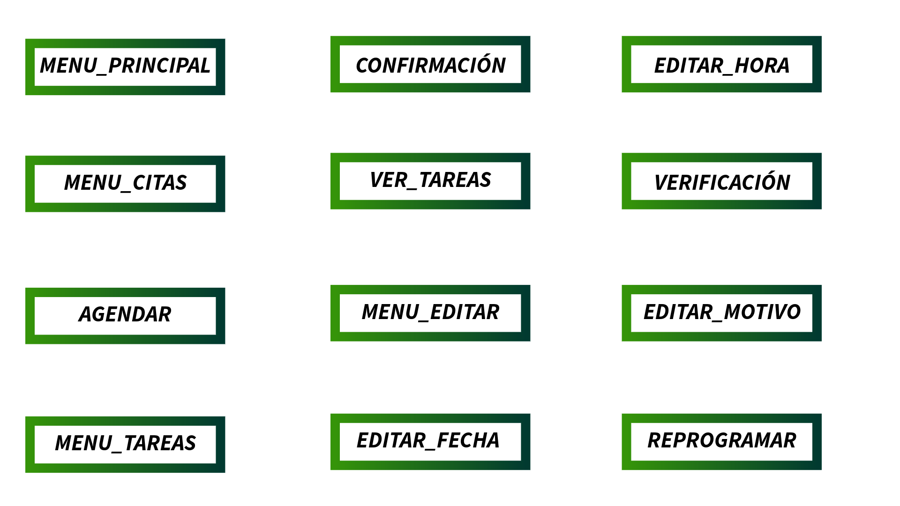

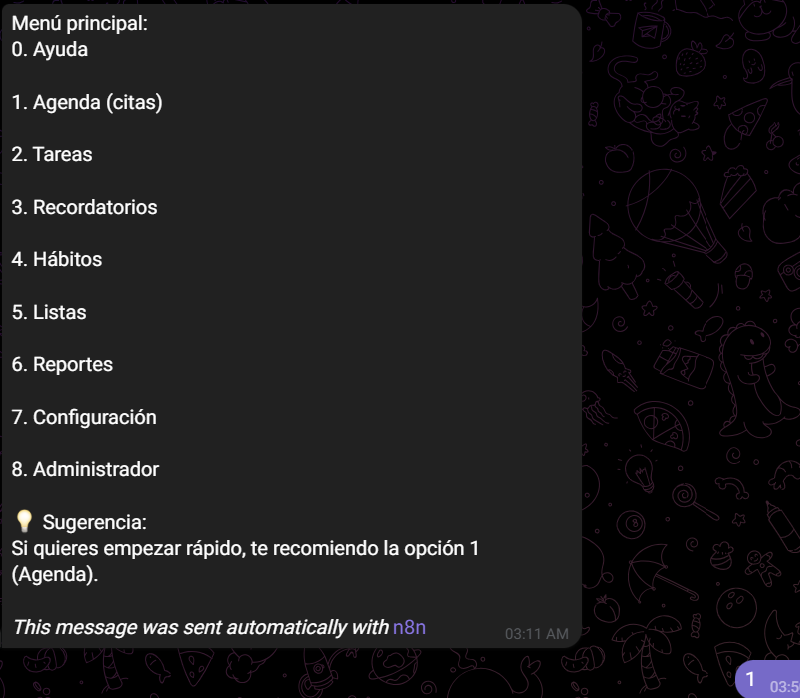

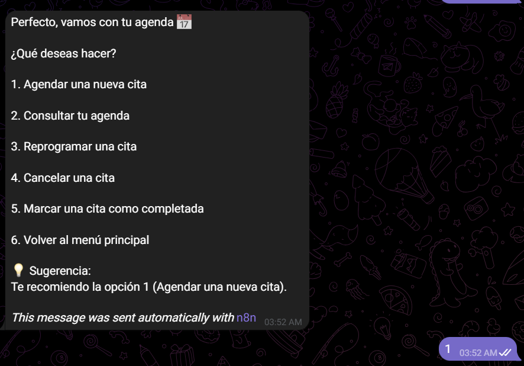

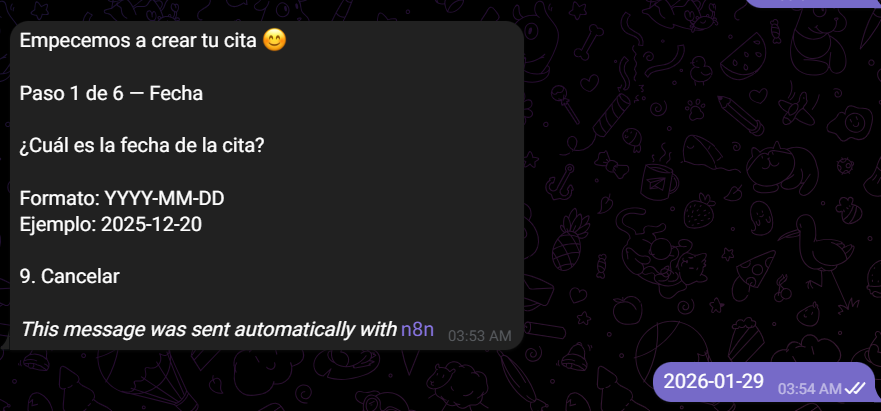

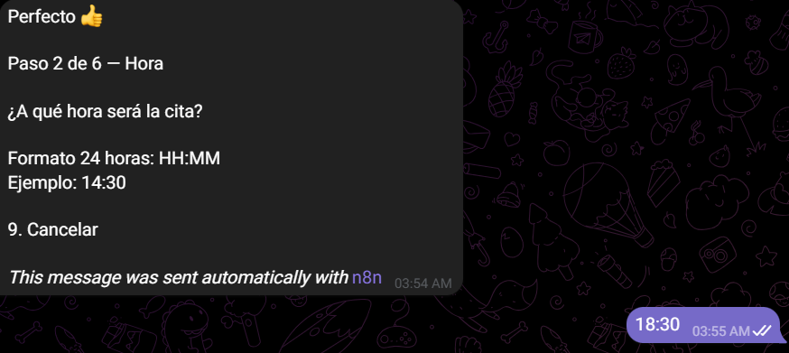

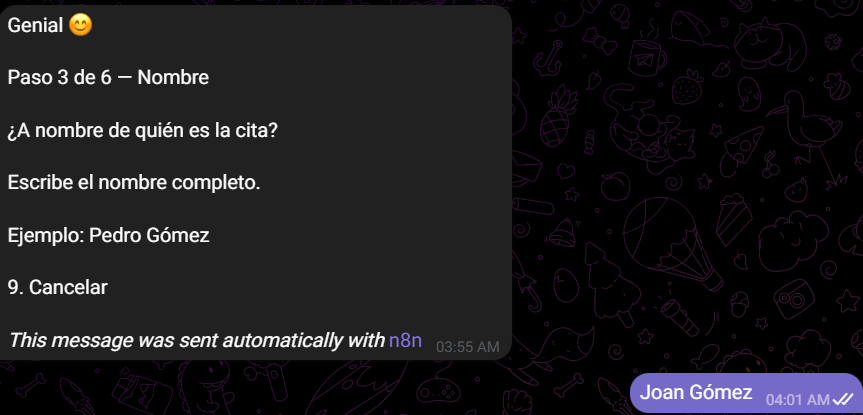

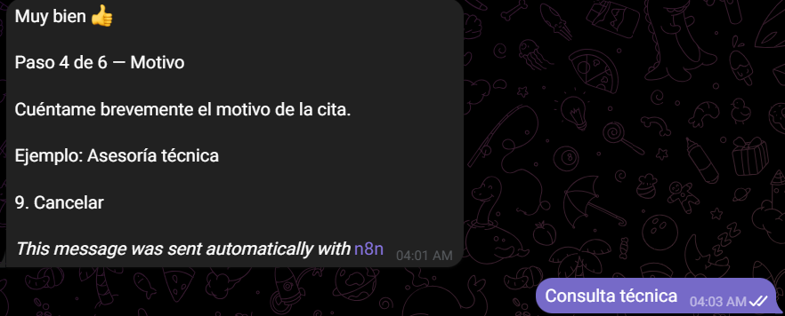

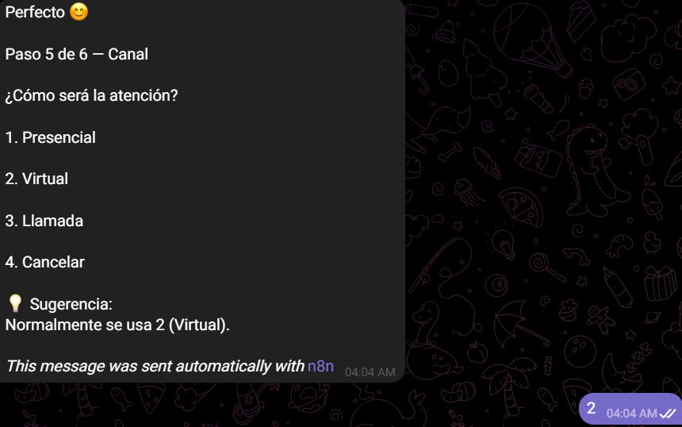

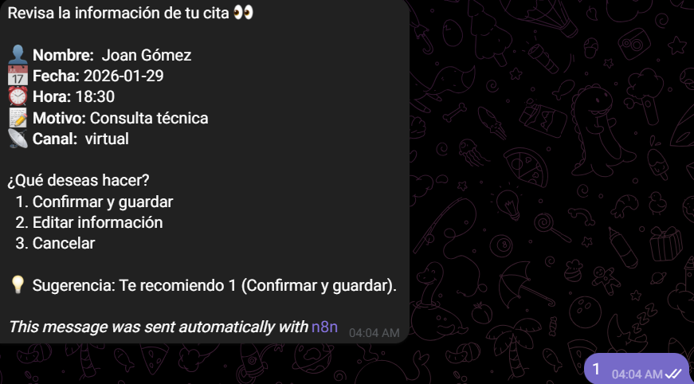

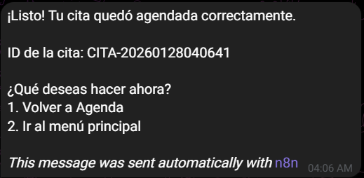