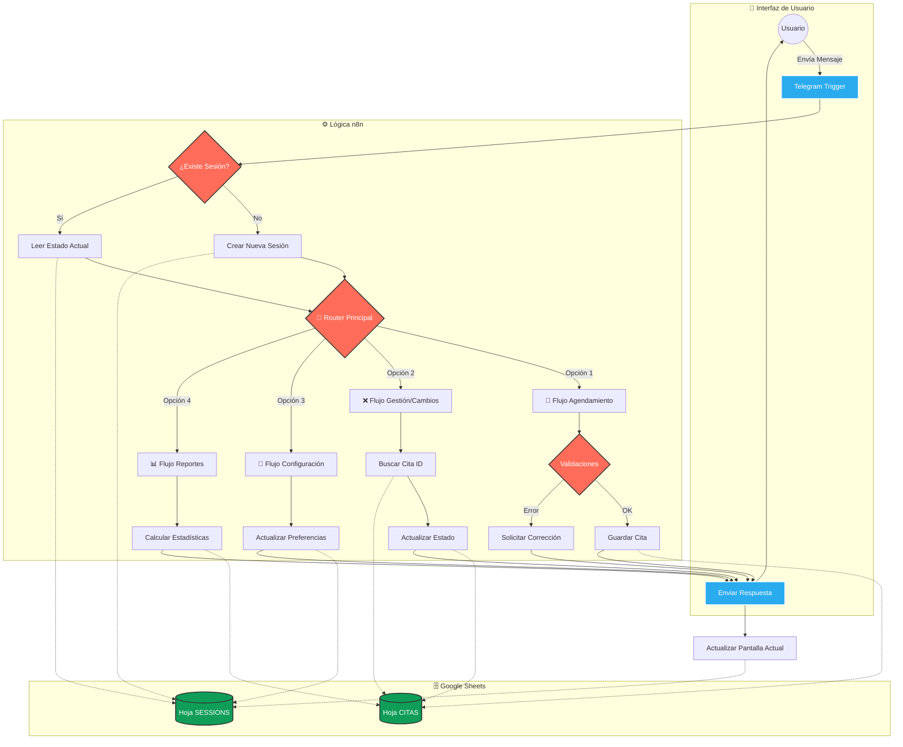

# AgendaBot Docs 📝

# 🤖 Sistema de Gestión de Citas Automatizado (Telegram Bot)

> **Versión:** 1.0.0  
> **Estado:** Producción  
> **Tecnologías:** n8n, Google Sheets, Telegram API, JavaScript (Node.js)

## 📖 1. Descripción General
Este proyecto es un **Asistente Virtual en telegram** diseñado para automatizar el ciclo completo de agendamiento de citas. El bot opera bajo un modelo de **Máquina de Estados Finitos**, guiando al usuario a través de flujos estructurados (contextos) para realizar solicitudes complejas de manera sencilla y validada.

El sistema actúa como intermediario entre el usuario (Front-end en Telegram) y la base de datos (Google Sheets), procesando la lógica de negocio en n8n.

---

## 🏗️ 2. Arquitectura del Sistema

El flujo de datos sigue el patrón **Webhook - Process - Database**:

1.  **Entrada (Input):** El usuario interactúa con el bot en Telegram.
2.  **Procesamiento (Logic):** n8n recibe el Webhook, identifica la sesión del usuario y determina el "Estado Actual" para enrutar la solicitud.
3.  **Persistencia (Storage):**
    * **SESSIONS:** Almacena el estado temporal de la conversación y preferencias del usuario.
4.  **Salida (Output):** El bot responde al usuario con confirmaciones, menús o alertas.

### Lógica general en n8n

---

## 🗃️ 3. Estructura de Datos (Google Sheets)

El sistema utiliza las hojas principales en google sheets para su funcionamiento:

### A. Hoja `SESSIONS` (Control de Estado)
Almacena la información del usuario y su contexto actual en el chat. Esta hoja es el corazón del funcionamiento del bot, ya que dependiendo del estado actual del usuario enruta los caminos hacia los procesos solicitados.

| Columna | Descripción |
| :--- | :--- |
| `telegram_user` | ID numérico único del usuario (Primary Key). |
| `first_name` | Nombre del usuario en Telegram. |
| `pantalla_actual` | Estado de la máquina (ej: `MENU_PRINCIPAL`, `ESPERANDO_FECHA`). |
| `datos_parciales` | JSON temporal para guardar datos mientras se completa el flujo (ej: `{ "fecha": "2025-10-10" }`). |
| `preferencia_aviso` | Minutos de antelación para recordatorios (ej: `60`, `1440`). |
| `alertas_activas` | Estado de las notificaciones (`TRUE` / `FALSE`). |

### B. Hoja `CITAS` (Registro de Eventos)
Base de datos transaccional de las reservas para las citas.

| Columna | Descripción |
| :--- | :--- |
| `id_cita` | Identificador único de la reserva. |
| `telegram_user` | ID del usuario propietario de la cita (Foreign Key). |
| `creado_por` | Nombre legible del usuario. |
| `fecha` | Fecha de la cita (Formato `YYYY-MM-DD`). |
| `hora` | Hora de la cita (Formato `HH:mm`). |
| `estado` | Estado actual: `Pendiente`, `Cancelada`, `Finalizada`. |
| `recordatorio_enviado`| Flag (`TRUE`/`FALSE`) para evitar duplicidad en alertas. |

### B. Hoja `TAREAS` (Registro de tareas)
Base de datos para almacenar las tareas que se creen por el usuario.

| Columna | Descripción |
| :--- | :--- |
| `id_cita` | Identificador único de la reserva. |
| `telegram_user` | ID del usuario propietario de la cita (Foreign Key). |
| `creado_por` | Nombre legible del usuario. |
| `fecha` | Fecha de la cita (Formato `YYYY-MM-DD`). |
| `hora` | Hora de la cita (Formato `HH:mm`). |
| `estado` | Estado actual: `Pendiente`, `Cancelada`, `Finalizada`. |
| `recordatorio_enviado`| Flag (`TRUE`/`FALSE`) para evitar duplicidad en alertas. |

### B. Hoja `CITAS` (Registro de Eventos)
Base de datos transaccional de las reservas para las citas.

| Columna | Descripción |
| :--- | :--- |
| `id_cita` | Identificador único de la reserva. |
| `telegram_user` | ID del usuario propietario de la cita (Foreign Key). |
| `creado_por` | Nombre legible del usuario. |
| `fecha` | Fecha de la cita (Formato `YYYY-MM-DD`). |
| `hora` | Hora de la cita (Formato `HH:mm`). |
| `estado` | Estado actual: `Pendiente`, `Cancelada`, `Finalizada`. |
| `recordatorio_enviado`| Flag (`TRUE`/`FALSE`) para evitar duplicidad en alertas. |

---

## 🧩 4. Módulos Funcionales

### 📅 1. Agendamiento (Nueva Cita)
Flujo guiado para crear una reserva.
* **Validaciones:**
    * **Formato:** Regex para asegurar fecha (`YYYY-MM-DD`) y hora (`HH:mm`) correctas.
    * **Anti-TimeTravel:** Bloqueo de fechas pasadas usando la librería `Luxon` (Zona horaria: America/Bogota).
    * **Anti-Colisión:** Verificación en tiempo real para evitar *double-booking* (dos citas a la misma hora).

### ❌ 2. Gestión de Citas (Cancelar/Reprogramar)
Permite al usuario modificar sus reservas existentes.
* Consulta filtrada por `telegram_user` (Privacidad: solo ve sus propias citas).
* Reprogramación con validación completa (reutiliza la lógica de agendamiento).
* Cancelación lógica (cambio de estado a `Cancelada`) para mantener historial.

### 🔔 3. Motor de Recordatorios
Sistema híbrido de notificaciones.
* **Configuración:** El usuario elige la antelación (30min, 1h, 24h) o desactiva las alertas.
* **Cron Job (Automático):** Workflow independiente que se ejecuta cada 10 minutos.
    * Cruza la tabla `CITAS` con `SESSIONS`.
    * Calcula `Tiempo Restante = Fecha Cita - Ahora`.
    * Si `Tiempo Restante <= Preferencia` y no se ha enviado antes → **Dispara Alerta**.

### 📊 4. Reportes y Analítica
Generación de resumen ejecutivo bajo demanda.
* Muestra estadísticas: Total citas, Pendientes, Canceladas.
* Muestra la próxima cita inmediata.
* Historial de los últimos eventos.

---

## ⚙️ 5. Lógica de Negocio y Validaciones Clave

El sistema implementa protecciones para asegurar la integridad de los datos:

1.  **Manejo de Sesiones:** Si un usuario escribe "Hola" a mitad de un proceso, el bot reconoce su estado actual y no reinicia la conversación abruptamente (a menos que se solicite).
2.  **Limpieza de Datos:** Conversión automática de horas (ej: `9:00` → `09:00`) para estandarización.
3.  **Seguridad por ID:** Todas las operaciones críticas (buscar, borrar, actualizar) se realizan mediante `telegram_user_id` y no por nombre de usuario, preveniendo errores por homónimos.

---

## 🚀 6. Despliegue y Workflows

El sistema consta de dos workflows independientes en n8n:

1.  **Main Bot Router:**
    * **Trigger:** Telegram Webhook.
    * **Función:** Maneja toda la interacción usuario-bot (Menús, Respuestas, Validaciones).
2.  **Reminder Engine:**
    * **Trigger:** Schedule (Intervalo: 10 min).
    * **Función:** Proceso silencioso de backend para envío de notificaciones.

---

## 📝 7. Futuras Mejoras (Roadmap)
* [ ] Integración con Google Calendar API.
* [ ] Generación de reportes en PDF.
* [ ] Panel de administración web para el dueño del negocio.

---
*Documentación generada automáticamente para el proyecto de Sistema de Citas.*